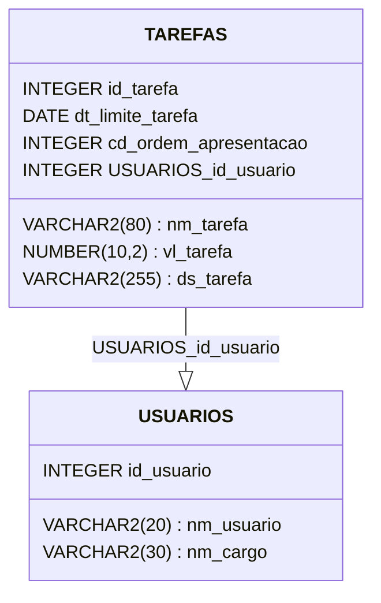

# Lista de Tarefas API

<a id="readme-top"></a>
Este é um projeto Spring Boot utilizando Maven, JPA, Hibernate e MySQL.
Backend de uma lista de tarefas, onde tem os principais verbos do CRUD.

## Requisitos

- Java 17 ou superior
- Maven 3.9.6 ou superior
- MySQL 8.3

## Configuração do Banco de Dados

Certifique-se de que o MySQL está instalado e em execução. Crie um banco de dados com o nome `meu_banco_de_dados`.

```sql
CREATE DATABASE meu_banco_de_dados;
```

Atenha-se apenas as variaveis para serem colocadas no `application.properties`.
A tabela e afins serão criadas automaticamente devido ao `JPA`.

## Configuração do Projeto

Atualize o arquivo `application.properties` com as configurações do seu banco de dados:

```properties
spring.datasource.url=jdbc:mysql://localhost:porta/meu_banco_de_dados
spring.datasource.username=seu_usuario
spring.datasource.password=sua_senha
spring.jpa.hibernate.ddl-auto=update
spring.jpa.show-sql=true
spring.jpa.properties.hibernate.dialect=org.hibernate.dialect.MySQL8Dialect
```

No caso do projeto, utilizei variáveis de ambiente para o deploy.

## Construção e Execução

Para construir o projeto, execute o seguinte comando:

```bash
mvn clean install
```

Para executar o projeto, utilize o comando:

```bash
mvn spring-boot:run
```

## Endpoints

A aplicação expõe os seguintes endpoints:

- `GET /tarefas` - Lista todas as tarefas
- `POST /tarefas` - Cria uma nova tarefas
- `PUT /tarefas/{id}` - Atualiza uma tarefas pelo ID
- `DELETE /tarefas/{id}` - Remove uma tarefas pelo ID

## Diagrama de Classes



## Contribuição

Contribuições são bem-vindas! Sinta-se à vontade para abrir uma issue ou enviar um pull request.

## Ferrametnas Utilizadas

- `Java`
- `Spring Boot`
- `Apache Maven`
- `Swagger`
- `MySQL`
- `IntelliJ`
- `VsCode`
- `Railway`

<p align="right">(<a href="#readme-top">Voltar Inicio</a>)</p>
